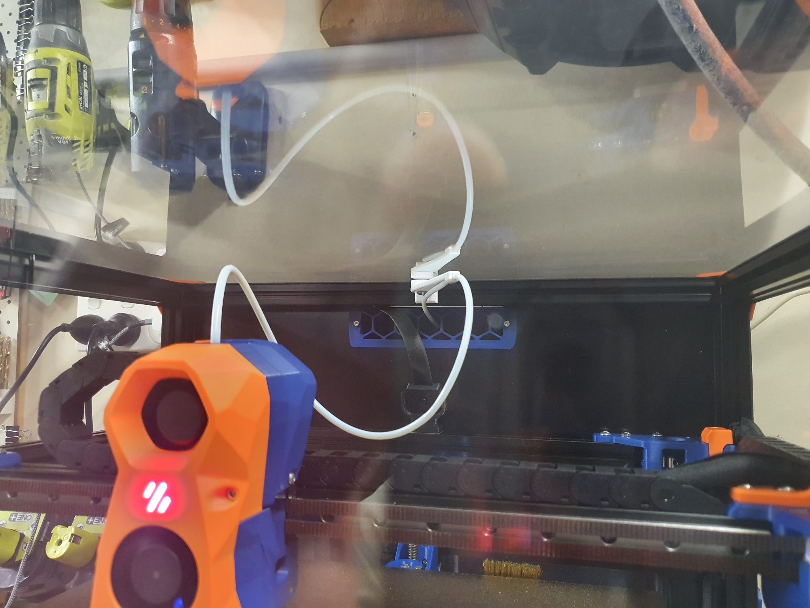

# PTFE bowden tube guide for Trident

## Required Hardware:
- M3x8 Bolt and M3 T-nut
- M5x10 Bolt or a M5x8
- Optional 4mm drill bit for cleaning out bowden tube path 

## About

In my 350 build the PFTE tube kept getting caught so i made the long arm to keep it up. Ive also added a short arm but i have not tested it yet but another user did and he prefered it to be shorter

## Install

- Drill out bowden guide with 4mm drill bit for a perfect fit
- Bolt mount to rear frame with M3x8 and tnut putting the lip at the top
- Screw arm on with M5x10 (I use a 8mm and it works fine) into the plastic allowing the arm to still be able to swivel 

